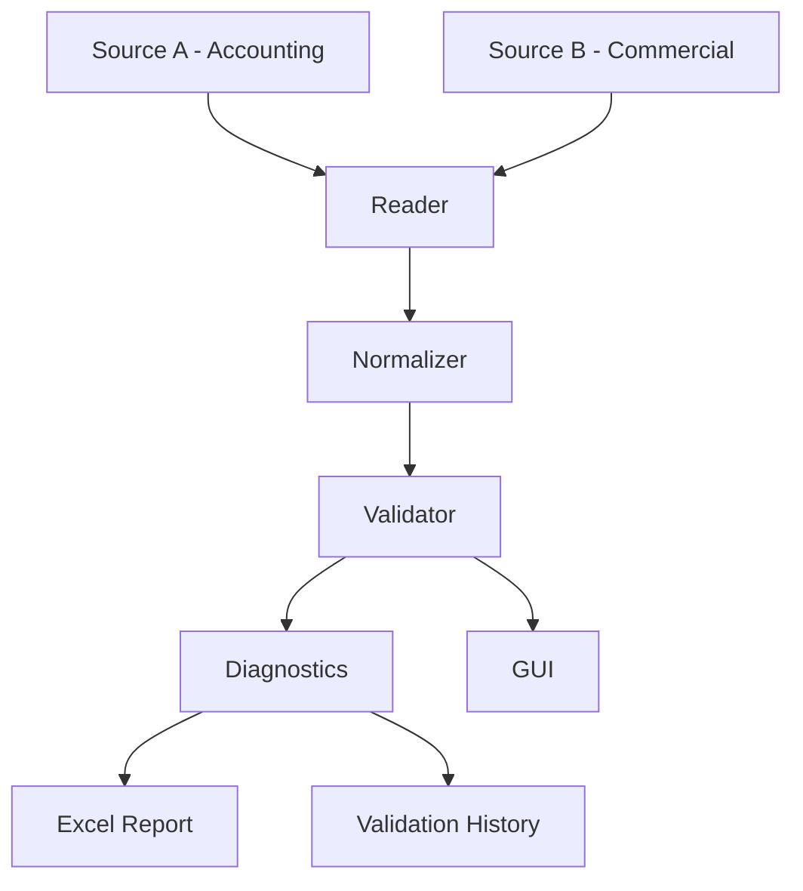

[🇧🇷 Português](README.pt-BR.md)

# UniversalDataValidator V14

[](https://github.com/soudiego95-collab/UniversalDataValidator/actions/workflows/ci.yml)

## Project overview

UniversalDataValidator is a modular Python application for comparing two
structured data sources, identifying inconsistencies, and producing traceable
validation reports.

The current implementation is **V14**. It was evolved from a functional
prototype into a layered project focused on Python, data validation, data
quality, automation, and analytics engineering practices.

The application reads Excel workbooks from two sources, standardizes the
relevant fields, compares documents and values, and produces an Excel report
with diagnostics, traceability, and validation history.

This is a technical portfolio project, not a commercial product or a claim of
production readiness.

## Screenshots

Screenshots of the GUI and generated report will be added here after capturing
them from a real application run.

## Business problem

Operational data is often distributed across different files and systems.
Those sources may disagree even when they refer to the same business document:

- a record may exist in one source but not in the other;
- a document may be duplicated;
- monetary values may differ;
- the responsible person may differ;
- manual checks can be slow and prone to error.

The project automates this reconciliation process and makes detected
inconsistencies explicit, categorized, and traceable to their source files and
rows.

## Solution

The validation pipeline is organized into specialized layers:

```text
Accounting / Source A
          ↓
       Reader
          ↓
     Normalizer
          ↓
      Validator
          ↑
Commercial / Source B
          ↓
    Diagnostics
          ↓
       Report
          ↓
History / Traceability
```

Each layer has a focused responsibility:

- **Reader** discovers Excel files, detects headers, recognizes columns, reads
  workbooks, and records processed and rejected files.
- **Normalizer** standardizes text and document identifiers and converts
  Brazilian monetary formats while distinguishing valid, missing, and invalid
  values.
- **Validator** applies the comparison rules for documents, values,
  responsible people, missing records, and duplicates.
- **Diagnostics** turns validation classifications into human-readable
  explanations.
- **Report** creates the Excel workbook and persists the validation history.
- **Engine** orchestrates the complete pipeline without depending on Tkinter.
- **GUI** collects configuration and displays the returned result through a
  Tkinter interface.

## Key features

- Recursive discovery of `.xlsx`, `.xls`, and `.xlsm` files.
- Automatic header detection for supported workbooks.
- Flexible recognition of equivalent column names.
- Document and text normalization.
- Brazilian currency conversion, including formats such as `R$ 1.234,56`.
- Detection of documents missing from either source.
- Duplicate document detection.
- Value discrepancy detection.
- Responsible-person discrepancy detection.
- Configurable value tolerance.
- Human-readable diagnostic messages.
- Validation history with new, resolved, and changed problems.
- Excel report generation with traceability tables.
- Tkinter graphical interface.
- Automated tests using pytest.

## Validation rules

The validator currently classifies the following situations:

- **Missing in Source A**: the document exists in Source B but not in Source A.
- **Missing in Source B**: the document exists in Source A but not in Source B.
- **Duplicate in Source A**: the document occurs more than once in Source A.
- **Duplicate in Source B**: the document occurs more than once in Source B.
- **Value discrepancy**: both sources contain the document, but their
  aggregated values differ beyond the configured tolerance.
- **Responsible discrepancy**: both sources contain the document, but the
  normalized responsible-person values differ.

The default tolerance is `0.01` and can be changed through the configuration
used by the application. Negative, non-finite, and otherwise invalid tolerance
values are rejected.

Document identifiers are normalized without intentionally removing meaningful
leading zeroes from string identifiers. Historical documents are loaded as
strings so that numeric-looking and alphanumeric identifiers can be compared
consistently. Monetary conversion preserves the distinction between missing
values and values that cannot be interpreted.

## Architecture

```text
src/
├── __init__.py
├── config.py
├── reader.py
├── normalizer.py
├── validator.py
├── diagnostics.py
├── report.py
├── engine.py
└── gui.py
```

- `config.py` — application configuration, paths, accepted extensions, and
  candidate column names.
- `reader.py` — file discovery, header detection, column recognition, and
  Excel reading.
- `normalizer.py` — text and document standardization and monetary conversion.
- `validator.py` — comparison and validation rules.
- `diagnostics.py` — human-readable explanations of detected problems.
- `report.py` — Excel report generation and validation history persistence.
- `engine.py` — orchestration of reading, preparation, validation, history, and
  reporting.
- `gui.py` — Tkinter graphical interface, including background execution and
  result visualization.
- `main.py` — minimal V14 application entry point.

## Validation workflow



## Project structure

```text
UniversalDataValidator/
├── input/
│   ├── contabilidade/
│   └── comercial/
├── output/
├── src/
├── tests/
├── main.py
├── requirements.txt
├── requirements-dev.txt
└── pytest.ini
```

The `input/` directory contains demonstration workbooks used by the local
project scenario. The `output/` directory is used for generated reports and
history and is intentionally treated as runtime output.

## Installation

The project requires Python with Tkinter available for the graphical interface.
Install the runtime dependencies with:

```bash
python -m pip install -r requirements.txt
```

For development and testing:

```bash
python -m pip install -r requirements-dev.txt
```

`tkinter` is part of the standard Python distribution on typical Windows
installations and is not listed in `requirements.txt`.

## Running the application

Launch the V14 graphical interface from the project root:

```bash
python main.py
```

The interface allows the user to configure:

- project directory;
- Source A directory;
- Source B directory;
- source names;
- value tolerance.

After execution, the interface shows a summary and allows the returned
validation tables to be inspected. The report and history are written to the
configured output directory.

The orchestration layer can also be used from Python:

```python
from src.config import AppConfig
from src.engine import run_validation

config = AppConfig(
    project_dir=project_directory,
    source_a_dir=source_a_directory,
    source_b_dir=source_b_directory,
    output_dir=output_directory,
    source_a_name="Accounting",
    source_b_name="Commercial",
    tolerance=0.01,
)

result = run_validation(config)
print(result.validation)
print(result["arquivo_excel"])
```

The paths in this example should be replaced with paths appropriate to the
local environment.

## Generated report

The report layer generates the validation workbook with tables including:

- summary panel;
- diagnostics;
- value discrepancies;
- responsible discrepancies;
- missing documents in each source;
- duplicates;
- source traceability;
- source bases;
- new problems;
- resolved problems;
- changed problems;
- complete validation output.

The current history file stores the minimum state required to compare
successive validations. Existing history documents are loaded with string
typing for the `Documento` field.

## Testing

Run the automated test suite from the project root:

```bash
python -m pytest -q
```

The initial suite covers normalization, validation rules, Excel reading, and
end-to-end engine scenarios using temporary controlled files rather than
depending on the demonstration workbooks.

The current project state contains 27 automated tests.

## Scope and limitations

This repository is an evolving portfolio project. The current scope is local
Excel comparison through a Python pipeline and Tkinter interface.

It does not currently claim to provide:

- a web interface;
- a database connector;
- a REST API;
- distributed processing;
- automatic deployment;
- cloud execution;
- a packaged executable;
- a formal production support model.

The project should be evaluated as a demonstration of modular design,
validation logic, traceability, and automated testing.

## License

This project is licensed under the MIT License. See [LICENSE](LICENSE) for
details.
