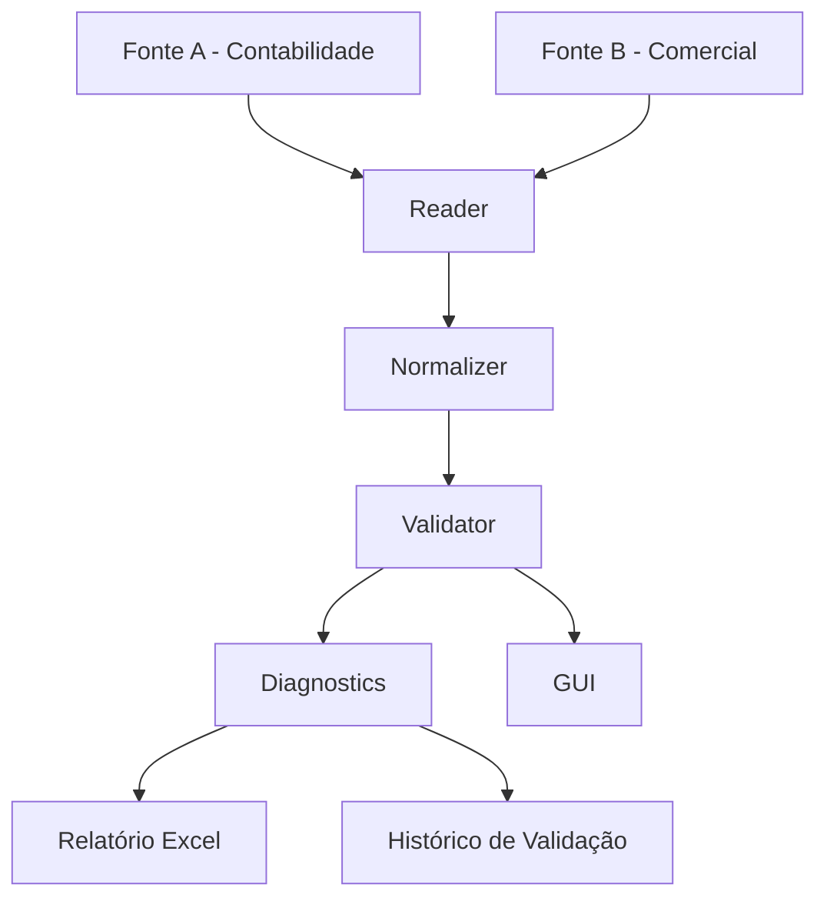

[🇺🇸 English](README.md)

# UniversalDataValidator V14

## Visão geral

O UniversalDataValidator é uma aplicação Python modular para comparar duas
fontes de dados estruturados, identificar inconsistências e produzir relatórios
de validação rastreáveis.

A implementação atual é a **V14**. O projeto evoluiu de um protótipo funcional
para uma aplicação em camadas, com foco em Python, validação de dados,
qualidade de dados, automação e práticas de Analytics Engineering.

A aplicação lê planilhas Excel de duas fontes, padroniza os campos relevantes,
compara documentos e valores e produz um relatório Excel com diagnósticos,
rastreabilidade e histórico de validações.

Este é um projeto técnico de portfólio. Ele não é um produto comercial e não
afirma estar pronto para produção.

## Problema de negócio

Dados operacionais frequentemente ficam distribuídos entre arquivos e sistemas
diferentes. Essas fontes podem apresentar divergências mesmo quando se referem
ao mesmo documento:

- um registro pode existir em uma fonte e não na outra;
- um documento pode estar duplicado;
- valores monetários podem divergir;
- o responsável pode divergir;
- conferências manuais podem ser demoradas e sujeitas a erros.

O projeto automatiza essa conferência e torna as inconsistências explícitas,
classificadas e rastreáveis até os arquivos e linhas de origem.

## Solução

O fluxo de validação é organizado em camadas especializadas:

```text
Contabilidade / Fonte A
          ↓
       Reader
          ↓
     Normalizer
          ↓
      Validator
          ↑
Comercial / Fonte B
          ↓
    Diagnostics
          ↓
       Report
          ↓
Histórico / Rastreabilidade
```

Cada camada possui uma responsabilidade específica:

- **Reader** localiza arquivos Excel, detecta cabeçalhos, reconhece colunas,
  lê planilhas e registra arquivos processados e rejeitados.
- **Normalizer** normaliza textos e identificadores de documentos e converte
  formatos monetários brasileiros, diferenciando valores válidos, ausentes e
  inválidos.
- **Validator** aplica as regras de comparação de documentos, valores,
  responsáveis, ausências e duplicidades.
- **Diagnostics** transforma as classificações da validação em explicações
  legíveis.
- **Report** gera o arquivo Excel e persiste o histórico da validação.
- **Engine** orquestra o pipeline completo sem depender do Tkinter.
- **GUI** coleta a configuração e apresenta o resultado por meio de uma
  interface Tkinter.

## Principais funcionalidades

- Localização recursiva de arquivos `.xlsx`, `.xls` e `.xlsm`.
- Detecção automática da linha de cabeçalho.
- Reconhecimento flexível de nomes equivalentes de colunas.
- Normalização de documentos e textos.
- Conversão de moeda brasileira, incluindo formatos como `R$ 1.234,56`.
- Identificação de documentos ausentes em uma das fontes.
- Identificação de documentos duplicados.
- Identificação de divergências de valor.
- Identificação de divergências de responsável.
- Tolerância de valores configurável.
- Mensagens de diagnóstico legíveis.
- Histórico de validação com problemas novos, resolvidos e alterados.
- Geração de relatório Excel com tabelas de rastreabilidade.
- Interface gráfica com Tkinter.
- Testes automatizados com pytest.

## Regras de validação

Atualmente, o validator classifica as seguintes situações:

- **Ausente na Fonte A**: o documento existe na Fonte B, mas não na Fonte A.
- **Ausente na Fonte B**: o documento existe na Fonte A, mas não na Fonte B.
- **Duplicidade na Fonte A**: o documento aparece mais de uma vez na Fonte A.
- **Duplicidade na Fonte B**: o documento aparece mais de uma vez na Fonte B.
- **Divergência de Valor**: o documento existe nas duas fontes, mas os valores
  agregados diferem além da tolerância configurada.
- **Divergência de Responsável**: o documento existe nas duas fontes, mas os
  responsáveis normalizados são diferentes.

A tolerância padrão é `0.01` e pode ser alterada na configuração usada pela
aplicação. Valores negativos, não finitos ou inválidos para a tolerância são
rejeitados.

Os identificadores de documentos são normalizados sem remover
intencionalmente zeros à esquerda significativos em identificadores textuais.
Documentos históricos são carregados como strings para que identificadores
numéricos e alfanuméricos sejam comparados de forma consistente. A conversão
monetária preserva a diferença entre valores ausentes e valores que não podem
ser interpretados.

## Arquitetura

```text
src/
├── __init__.py
├── config.py
├── reader.py
├── normalizer.py
├── validator.py
├── diagnostics.py
├── report.py
├── engine.py
└── gui.py
```

- `config.py` — configuração da aplicação, caminhos, extensões aceitas e
  candidatos de nomes de colunas.
- `reader.py` — descoberta de arquivos, detecção de cabeçalho, reconhecimento
  de colunas e leitura de Excel.
- `normalizer.py` — padronização de textos e documentos e conversão monetária.
- `validator.py` — regras de comparação e validação.
- `diagnostics.py` — explicações legíveis dos problemas identificados.
- `report.py` — geração do relatório Excel e persistência do histórico.
- `engine.py` — orquestração da leitura, preparação, validação, histórico e
  relatório.
- `gui.py` — interface Tkinter, execução em thread e visualização dos
  resultados.
- `main.py` — entry point mínimo da aplicação V14.

## Fluxo de validação



## Estrutura do projeto

```text
UniversalDataValidator/
├── input/
│   ├── contabilidade/
│   └── comercial/
├── output/
├── src/
├── tests/
├── main.py
├── requirements.txt
├── requirements-dev.txt
└── pytest.ini
```

O diretório `input/` contém planilhas demonstrativas usadas no cenário local do
projeto. O diretório `output/` recebe os relatórios e o histórico gerados em
tempo de execução e é tratado como diretório de saída.

## Instalação

O projeto requer Python com Tkinter disponível para a interface gráfica.
Instale as dependências de execução com:

```bash
python -m pip install -r requirements.txt
```

Para desenvolvimento e testes:

```bash
python -m pip install -r requirements-dev.txt
```

O `tkinter` faz parte da distribuição padrão do Python em instalações típicas
do Windows e por isso não está listado em `requirements.txt`.

## Execução da aplicação

Inicie a interface gráfica da V14 a partir da raiz do projeto:

```bash
python main.py
```

A interface permite configurar:

- diretório do projeto;
- diretório da Fonte A;
- diretório da Fonte B;
- nomes das fontes;
- tolerância de valores.

Após a execução, a interface mostra um resumo e permite consultar as tabelas
retornadas pela validação. O relatório e o histórico são gravados no diretório
de saída configurado.

A camada de orquestração também pode ser usada diretamente em Python:

```python
from src.config import AppConfig
from src.engine import run_validation

config = AppConfig(
    project_dir=project_directory,
    source_a_dir=source_a_directory,
    source_b_dir=source_b_directory,
    output_dir=output_directory,
    source_a_name="Contabilidade",
    source_b_name="Comercial",
    tolerance=0.01,
)

result = run_validation(config)
print(result.validation)
print(result["arquivo_excel"])
```

Os caminhos do exemplo devem ser substituídos por caminhos adequados ao
ambiente local.

## Relatório gerado

A camada de relatório gera um arquivo Excel com tabelas que incluem:

- painel resumido;
- diagnósticos;
- divergências de valor;
- divergências de responsável;
- documentos ausentes em cada fonte;
- duplicidades;
- rastreabilidade das fontes;
- bases das fontes;
- novos problemas;
- problemas resolvidos;
- problemas alterados;
- resultado completo da validação.

O histórico atual armazena o estado mínimo necessário para comparar execuções
sucessivas. Documentos do histórico são carregados como strings no campo
`Documento`.

## Testes

Execute a suíte automatizada na raiz do projeto:

```bash
python -m pytest -q
```

A suíte inicial cobre normalização, regras de validação, leitura de Excel e
cenários completos do engine utilizando arquivos temporários controlados, sem
depender das planilhas demonstrativas.

O estado atual do projeto possui 27 testes automatizados.

## Escopo e limitações

Este repositório é um projeto de portfólio em evolução. O escopo atual é a
comparação local de planilhas Excel por meio de um pipeline Python e de uma
interface Tkinter.

Atualmente, o projeto não afirma oferecer:

- interface web;
- conexão com banco de dados;
- API REST;
- processamento distribuído;
- deploy automático;
- execução em nuvem;
- executável empacotado;
- modelo formal de suporte em produção.

O projeto deve ser avaliado como uma demonstração de design modular, lógica de
validação, rastreabilidade e testes automatizados.

## Licença

Este projeto está licenciado sob a Licença MIT. Consulte o arquivo
[LICENSE](LICENSE) para mais detalhes.
